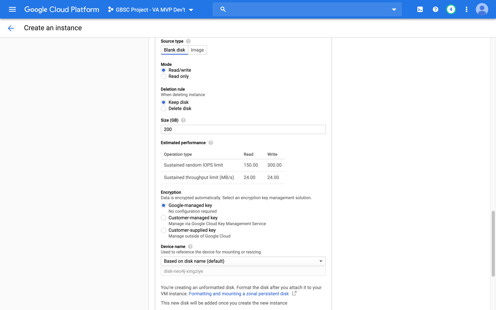
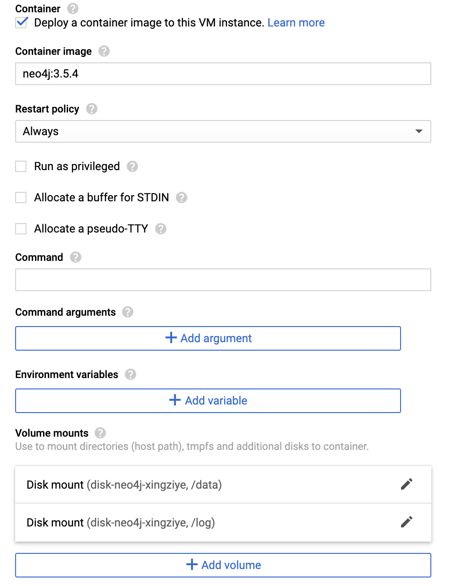

# Neo4j database deployment

These instructions describe how to deploy a Neo4j instance on Google Cloud Platform using the Neo4j community Docker image. Before doing this, we recommend setting up your VPC network via the network configuration instructions.

You can deploy your neo4j instance either through [Cloud Console](#a.-google-cloud-console) or SDK command line tool.

## A. Google Cloud Console
1. Navigate to the Compute Engine section from your project's console. At the top of the page, click the "Create Instance" button.

1. Fill the form with your preferred name, region, and zone for the instance. For instance machine configuration, we can choose "n1-highmem-2" type under N1 series with 2 virtual CPUs and 13GB memory, which should be good enough for our database deployment.

1. Check the box of "Deploy a container image to this VM instance". This allows us to create the instance directly with a neo4j container deployed on startup. Use `neo4j:tag` for the name of image, and replace the tag with your preferred version, or simply with `neo4j:latest`.

1. It is often a good practice to keep database and logs outside of the container. Thus, using a persistent disk for your data storage is highly recommended. At the bottom of the page, expand more options by clicking "Management, security, disks, networking, sole tenancy". Under "Disks" tab and locate "Additional disks" section, click "Add new disk" or "Attach existing disk" if you have created one before.

1. Set the size of your new disk. 200 GB should be more that enough storage. We usually label disks by environment (e.g. "dev", "test", "prod"), but naming is arbitrary and you can call it as what you want. (Optional) Add an existing snapshot policy. This will create snapshots of your disk on a regular basis, so you can revert to an earlier data state in case you encounter an issue with your database. More information can be found here: https://cloud.google.com/blog/products/compute/introducing-scheduled-snapshots-for-compute-engine-persistent-disk. When you finish, click "done".

1. Return back to the "Container" section. Expand more options by clicking "Advanced container options". Under "Volume mounts", select "Disk" as "Volume Type", set "Mount path" as `/data`, select the disk you created from previous step for "Disk name", and choose "Read/write" mode and click "Done". Do the similar for `/log` path as well.

1. For network setting, you can join any desired VPC network for firewall rules and other security considerations. You can also reserve a permanent external IP address for your database so the IP address would stay the same after any unexpected shutdown and restart.

1. Once done, click the "Create" button at the bottom of the form and your instance should be ready in just a few minutes.
