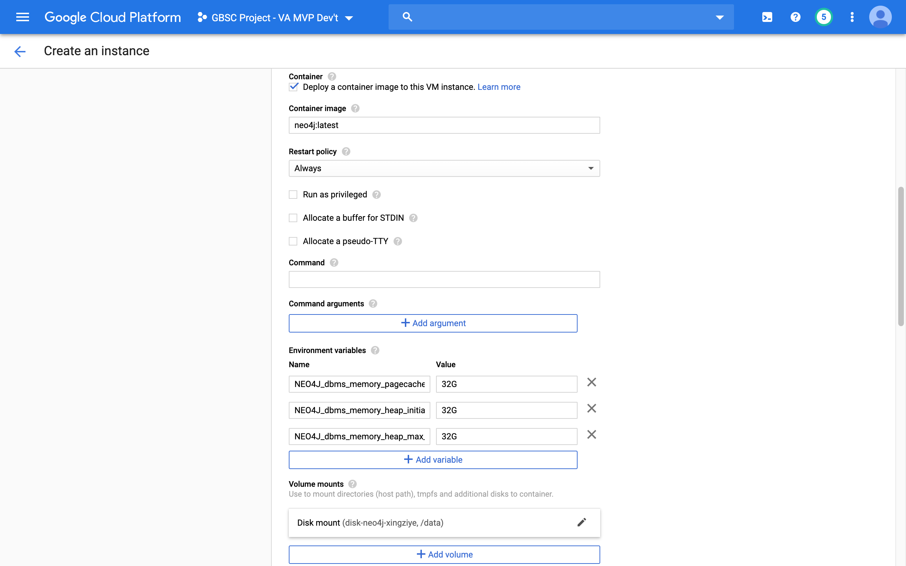

# Neo4j database deployment

These instructions describe how to deploy a Neo4j instance on Google Cloud Platform using the Neo4j community Docker image. Before doing this, we recommend setting up your VPC network via the network configuration instructions.

You can deploy your neo4j instance either through [Cloud Console](#a-google-cloud-console) or [SDK command line tool](#b-gcloud-command-line-tool).

## A. Google Cloud Console
1. Navigate to the Compute Engine section from your project's console. At the top of the page, click the "Create Instance" button.

2. Fill the form with your preferred name, region, and zone for the instance. For instance machine configuration, we choose "n1-highmem-2" type under N1 series with 2 virtual CPUs and 13GB memory for demonstration. Select your machine type according to your needs.

3. Check the box of "Deploy a container image to this VM instance". This allows us to create the instance directly with a neo4j container deployed on startup. Use `neo4j:tag` for the name of image, and replace the tag with your preferred version. This documentation is tested on `neo4j:3.5.4`.

4. It is often a good practice to keep database and logs outside of the container. Thus, using a persistent disk for your data storage is highly recommended. At the bottom of the page, expand more options by clicking "Management, security, disks, networking, sole tenancy". Under "Disks" tab and locate "Additional disks" section, click "Add new disk" or "Attach existing disk" if you have created one before.

5. Set the size of your new disk. 200 GB should be more that enough storage. We usually label disks by environment (e.g. "dev", "test", "prod"), but naming is arbitrary and you can call it as what you want. (Optional) Add an existing snapshot policy. This will create snapshots of your disk on a regular basis, so you can revert to an earlier data state in case you encounter an issue with your database. More information can be found here: [Introducing scheduled snapshots for Compute Engine persistent disk](https://cloud.google.com/blog/products/compute/introducing-scheduled-snapshots-for-compute-engine-persistent-disk). When you finish, click "done".


6. Return back to the "Container" section. Expand more options by clicking "Advanced container options". Under "Volume mounts", select "Disk" as "Volume Type", set "Mount path" as `/data`, select the disk you created from previous step for "Disk name", and choose "Read/write" mode and click "Done". You can do the similar for `/log` path as well.

7. The default heap and page cache sizes for Neo4j images are 512 MB. If you are doing anything serious, this isn't going to cut it. There are three ways to modify the configuration:
 * Set environment variables.
 * Mount a /conf volume.
 * Build a new image.

 Here we will show how to set environment variables to increase heap and page cache sizes. (Note: The community edition of Neo4j also limits you to using 4 CPUs to run the database. Unfortunately, you can't raise the CPU count without buying an Enterprise license. In practice, we've found that this limits you to about 20 concurrent database connections.)

 Set conf key/value pairs in Environment variables section. See [Configuration settings](https://neo4j.com/docs/operations-manual/current/reference/configuration-settings/) for all available settings.
 ```
NEO4J_dbms_memory_pagecache_size=5G
NEO4J_dbms_memory_heap_initial__size=5G
NEO4J_dbms_memory_heap_max__size=5G
 ```
 

8. For network setting, you can join any desired VPC network for firewall rules and other security considerations. By default, the Docker image exposes three ports for remote access:
 * 7474 for HTTP.
 * 7473 for HTTPS.
 * 7687 for Bolt.

 According to GCP, VMs with containers use the host network mode, where container ports have a one-to-one mapping to the host VM ports, so you don't have to publish ports explicitly. You can also reserve a permanent external IP address for your database so the IP address would stay the same after any unexpected shutdown and restart.

9. Once done, click the "Create" button at the bottom of the form and your instance should be ready in just a few minutes.

## B. gcloud command-line tool
We can also accomplish the operation above by using Google Cloud SDK CLI tool. The minimal command to achieve the similar effect demonstrated in the previous section is shown as below:
```
gcloud compute instances create-with-container ${INSTANCE_NAME} \
    --machine-type=${MACHINE_TYPE} \
    --container-image neo4j:${NEO4J_VERSION} \
    --container-env NEO4J_dbms_memory_pagecache_size=${PAGECACHE_SIZE},NEO4J_dbms_memory_heap_initial__size=${HEAP_INIT_SIZE},NEO4J_dbms_memory_heap_max__size=${HEAP_MAX_SIZE} \
    --create-disk name=${DISK_NAME},size=${DISK_SIZE},auto-delete=no \
    --container-mount-disk mount-path="/data",name=${DISK_NAME}
```
There are more optional flags can be specified and some of the common ones are:
```
    --project=${PROJECT_ID} \
    --zone=${ZONE} \
    --network=${NETWORK} \
    --private-network-ip=${PRIVATE_IP} \
    --address=${EXTERNAL_IP} \
    --tags=${NEO4J_TAG} \
    --boot-disk-size=10GB \
    --disk "name=${DISK_NAME},device-name=${DISK_NAME},mode=rw,boot=no" \
```
Refer Google Cloud Documentation for full specifications:
* [Configuring options to run your Container](https://cloud.google.com/compute/docs/containers/configuring-options-to-run-containers)
* [gcloud compute instances create-with-container](https://cloud.google.com/sdk/gcloud/reference/compute/instances/create-with-container)

<!--
gcloud compute instances create-with-container trellis-neo4j-xingziye \
    --machine-type=n1-highmem-2 \
    --tags=neo4j \
    --address=trellis-neo4j-xingziye \
    --container-image neo4j:3.5.4 \
    --container-env NEO4J_dbms_memory_pagecache_size=5G,NEO4J_dbms_memory_heap_initial__size=5G,NEO4J_dbms_memory_heap_max__size=5G \
    --create-disk name=disk-neo4j-xingziye,size=200GB,auto-delete=no \
    --container-mount-disk mount-path="/data",name=disk-neo4j-xingziye
--!>
